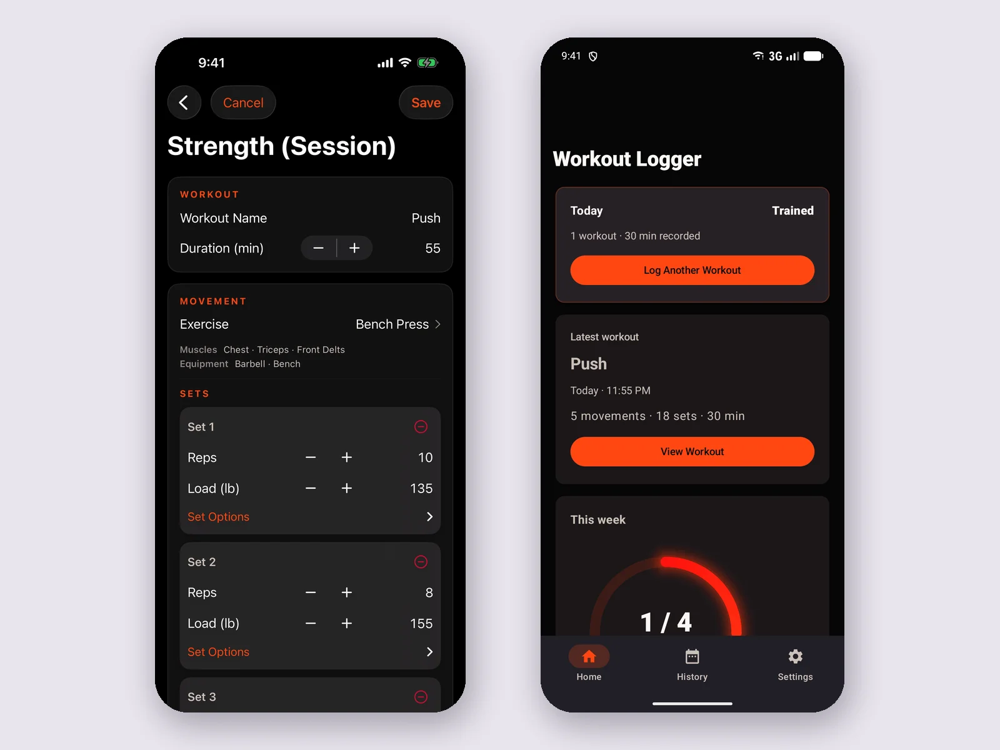

# Portfolio screenshot handoff

The portfolio remains a static HTML/CSS site hosted on GitHub Pages. No React migration or build step is necessary.

## Status

| Project                  | Status                          | Image                                     |
| ------------------------ | ------------------------------- | ----------------------------------------- |
| Mastadon                 | Done — real app screenshot      | `assets/img/websites/mastadon.webp`       |
| Stock Lab (`stocks`)     | Done — real app screenshot      | `assets/img/websites/stock-lab.webp`      |
| Workout Logger Universal | Still a placeholder             | —                                         |
| NJ Pacific Deals (`storefront`) | Done — live-site screenshot | `assets/img/websites/nj-pacific-deals.webp` |

The Mastadon and Stock Lab screenshots come from the applications actually running against seeded demo data. The NJ Pacific Deals screenshot is the deployed storefront at https://njpacificdeals.com/, captured at 1600x1000 with Playwright; its listings are real and public on eBay, and the shop view is filtered to Shoes so the grid reads well at card size. No credentials, account identifiers, customer details, or private financial information appear in any of them. The Stock Lab market history is synthetic demo data generated for the capture; the anomalies, detector output, and chart were produced by Stock Lab's own scanner from that data, not hand-drawn.

## Remaining: Workout Logger Universal

This one needs a machine the other two do not.

- **iOS (SwiftUI)** requires macOS and Xcode. It cannot be built or run on Linux at all.
- **Android (Jetpack Compose)** requires the Android SDK from `dl.google.com`, plus either a hardware-accelerated emulator (`/dev/kvm`) or a physical device.

The practical path is to capture it on the Mac that already builds the app:

1. Run the app in the iOS Simulator, get a workout logging screen into a populated state (a session in progress with a few sets recorded reads better than an empty log).
2. Capture with `⌘S` in Simulator, or `xcrun simctl io booted screenshot workout-logger.png`.
3. For Android, capture from Android Studio's emulator toolbar or `adb exec-out screencap -p > workout-android.png`.
4. Convert to WebP at roughly 1600px wide and save as `assets/img/websites/workout-logger.webp`.

A composed iOS/Android side-by-side is only worth it if both captures are available and stay legible at the card size; otherwise a single native screen is stronger.

Then replace the placeholder block in `index.html` (search for `workout-art`) with:

```html
<div class="project-art workout-art">
  
</div>
```

Use the image's actual dimensions in `width`/`height`. `.project-art img` already applies `object-fit: contain`, so app controls are never cropped. Avoid screenshots of empty states or development errors.

## Note for whoever reseeds Mastadon

Mastadon's inventory table needs 1201px but its card caps the content area at 1150px, so the rightmost "Next step" column sits behind a ~51px horizontal scroll at every desktop width. That is why the featured card uses the stock-detail workflow screen rather than the inventory list.

## Validate

Run `python3 -m http.server 8000`. Inspect desktop, tablet, and 390px mobile widths; ensure screenshots remain legible, images load, and the page does not overflow. Check anchor links, the earlier-work disclosure, keyboard focus, JavaScript-disabled content, and reduced-motion behavior. Review before merging into the existing GitHub Pages publishing branch.
