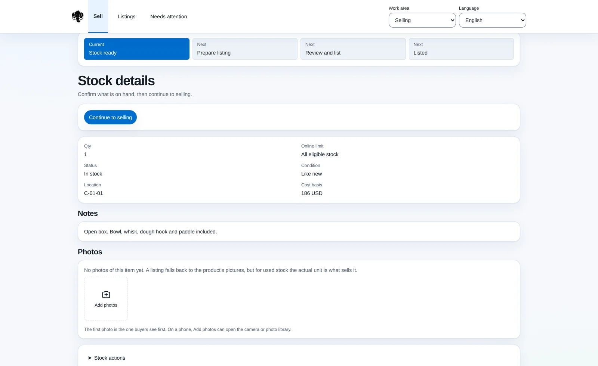

# Portfolio screenshot handoff

The portfolio remains a static HTML/CSS site hosted on GitHub Pages. No React migration or build step is necessary.

## Screenshots to capture

Run the apps in their own repositories and capture useful, populated screens with safe demo data. Do not expose credentials, account identifiers, customer details, or private financial information.

| Project                  | Suggested screen                                                                           | Target image                              |
| ------------------------ | ------------------------------------------------------------------------------------------ | ----------------------------------------- |
| Mastadon                 | Inventory or selling workspace with representative items and clear workflow                | `assets/img/websites/mastadon.webp`       |
| Stock Lab (`stocks`)     | Research dashboard or a thesis/anomaly view with chart and supporting context              | `assets/img/websites/stock-lab.webp`      |
| Workout Logger Universal | Native workout logging screen; use a composed iOS/Android image only if both are available | `assets/img/websites/workout-logger.webp` |

Use actual app screenshots. Aim for 1600px wide web images and keep native captures legible. Optimize as WebP. Avoid screenshots of empty states or development errors.

## Replace the placeholders

`index.html` contains three `.project-art` blocks with explicit screenshot placeholder labels. Replace the inside of each block with an image, remove `role="img"` and `aria-label` from its container, and use meaningful image alt text. For example:

```html
<div class="project-art mastadon-art">
  
</div>
```

Use the image's actual dimensions. Existing CSS uses `object-fit: contain` to avoid cropping app controls. Adjust slot height if necessary. The current decorative CSS/SVG graphics are placeholders, not representations of the apps or actual market data.

Keep the original hero background and original logo artwork. Preserve the resume-based project descriptions unless the owner requests changes. Repositories for the three featured projects are currently private, so there are intentionally no public source or demo buttons.

## Validate

Run `python3 -m http.server 8000`. Inspect desktop, tablet, and 390px mobile widths; ensure screenshots remain legible, images load, and the page does not overflow. Check anchor links, the earlier-work disclosure, keyboard focus, JavaScript-disabled content, and reduced-motion behavior. Review before merging into the existing GitHub Pages publishing branch.
